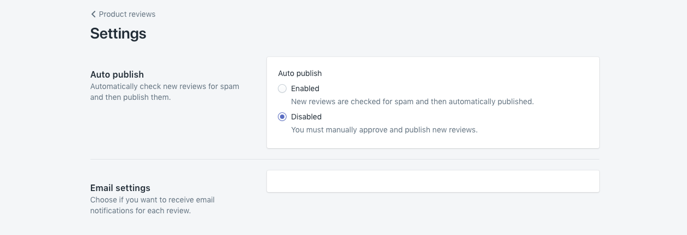
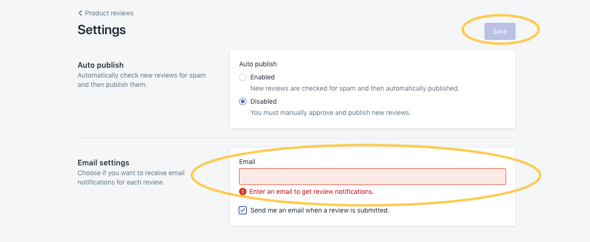

# Settings and forms

Now that we have the index and show pages done for our reviews, let's walk through how to build the settings page of the app.

Load the settings page to see what it currently looks like. You should see something like this:


What we want to end up with is something like this:


## The set-up

Form views tend to get pretty complex, so to save time and allow for a more detailed walk through, we have built a fairly complete starting point for the settings view. Let's dive in and make sure we understand the set up.

First, open `src/routes/Settings.js`.

### Components
We've imported a few components from Polaris. We've also got a React component class with an initial form state and some event handlers for our form fields (`handleAutoPublishChange`, `handleEmailChange`, `handleFormSubmit`). One thing you may not recognize is the `getDerivedStateFromProps` method. Instead of _manually_ grabbing the initial state of the merchant's settings from the data we receive as props through our GraphQL query, we're making use of this brand new component lifecycle method made available from the 16.3 release of React and onward.

```jsx
  static getDerivedStateFromProps({settingsQuery}) {
    if (settingsQuery.loading) {
      return null;
    }

    const {
      settings: {autoPublish, email, emailNotifications},
    } = settingsQuery;

    return {autoPublish, email, emailNotifications};
  }
```

This method gives you the component's incoming props as its first parameter and the component's previous state as its second parameter (not used here). We deconstruct the incoming props, then check to see if we're still loading the data. If we're not loading, we can safely return the data we requested through GraphQL. The object we return gets automatically merged into the component's state, which we initialized with the same properties.

### Getting data through GraphQL

We fetch the merchant's current settings through the GraphQL query built at the bottom of this file. Calling the React Apollo `compose` higher order function with our `Settings` component means we can expect to receive `data` as a prop on our `Settings` component.

The first bit of GraphQL at the bottom of the file is a query that returns three fields from the `settings` object:

```jsx
graphql(
  gql`
    query SettingsQuery {
      settings {
        autoPublish
        emailNotifications
        email
      }
    }
  `,
  {
    name: 'settingsQuery',
  },
)
```

The second bit of GraphQL is a mutation which takes in three values which it uses to update three fields, and it then returns the result of querying those three fields:

```jsx
graphql(
  gql`
    mutation updateSettings(
      $autoPublish: Boolean
      $emailNotifications: Boolean
      $email: String
    ) {
      updateSettings(
        autoPublish: $autoPublish
        emailNotifications: $emailNotifications
        email: $email
      ) {
        autoPublish
        emailNotifications
        email
      }
    }
  `,
  {
    name: 'updateSettingsMutation',
  },
)
```

### The Form

Our settings page is going to act as one large form, where we will take input from the merchant about their settings and save it.

Our page is wrapped in the Polaris `Form` component, which will handle the form's submission. We've chosen to do this instead of passing the submit handler to the save button's `onClick` prop.

```jsx
<Form onSubmit={this.handleFormSubmit}>
  <Page title="Settings" breadcrumbs={[{content: 'Product reviews', url: '/'}]}>
    {/* page layout content */}
  </Page>
</Form>
```

### Annotated Layout

Next, we've handled the loading state of the view. We use the `Layout` component much like we did in the show page. Only this time, we used the `Layout.AnnotatedSection` subcomponent. An annotated section is used to give a title and description to a section of content. This is useful in settings pages where you need to give more context about what the merchant is changing.

Just like we did with our reviews list, we store the loading state content in a variable and use the `data` prop's loading property to determine whether or not to show skeleton content.

```jsx
const loadingStateContent = loading ? (
  <Layout>
    <Layout.AnnotatedSection
      title="Auto publish"
      description="Automatically check new reviews for spam and then publish them."
    >
      <Card sectioned>
        <TextContainer>
          <SkeletonDisplayText size="small" />
          <SkeletonBodyText />
        </TextContainer>
      </Card>
    </Layout.AnnotatedSection>
    <Layout.AnnotatedSection
      title="Email settings"
      description="Choose if you want to receive email notifications for each review."
    >
      <Card sectioned>
        <TextContainer>
          <SkeletonDisplayText size="small" />
          <SkeletonBodyText />
        </TextContainer>
      </Card>
    </Layout.AnnotatedSection>
  </Layout>
) : null;
```

Now that we're familiar with the set up of this view, let's dig into building out the fields of our form.

## Building a form

### Choice list

Next, let's build the auto publish field. This field allows merchants to enable and disable auto publishing of reviews as they are submitted by their customers. To do that, we will use the Polaris `ChoiceList` component. Choice lists display a list of checkboxes or radio buttons to gather choice input. Let's explore the props required by choice lists in the [style guide](https://polaris.shopify.com/components/forms/choice-list).

Add `ChoiceList` to the Polaris component import at the top of the file.

```jsx
import {
  Form,
  Page,
  Layout,
  Card,
  TextContainer,
  SkeletonBodyText,
  SkeletonDisplayText,
  ChoiceList,
} from '@shopify/polaris';
```

Use a `ChoiceList` to replace the comment in the card of the first annotated section of the `settingsFormContent` variable.

```jsx
<ChoiceList
  title="Auto publish"
  choices={[
    {
      label: 'Enabled',
      value: 'enabled',
      helpText:
        'New reviews are checked for spam and then automatically published.',
    },
    {
      label: 'Disabled',
      value: 'disabled',
      helpText: 'You must manually approve and publish new reviews.',
    },
  ]}
  onChange={this.handleAutoPublishChange}
/>
```

Oops, we get an error. Using the style guide, can you figure out what prop we're missing?

The `selected` prop is required for a `ChoiceList` so we need to know which of the choices in the list should be selected when the merchant loads the page. The value we select should be based on the data returned through GraphQL, which is already stored in the component's state thanks to `getDerivedStateFromProps`. The value to select is already captured in `autoPublishSelected`:

```jsx
const autoPublishSelected = autoPublish ? ['enabled'] : ['disabled'];
```

Use `autoPublishSelected` to set the `selected` prop of the `ChoiceList` you just created:

```jsx
selected={autoPublishSelected}
```

We now have the top half of our settings page figured out:



### Form submission

We need to add a submit button to be able to actually submit the form. For this we _could_ use a Polaris `PageActions` component (look it up in the style guide to find out what it is), but it is best practice to use the `Page` component's `primaryAction` prop. This will work in conjunction with the context bar that rests above your app when it is rendered inside the Shopify admin. The context bar signifies to the merchant that they have unsaved changes on the page that need to be saved.

```jsx
<Form>
  <Page
    title="Settings"
    breadcrumbs={[{content: 'Product reviews', url: '/'}]}
    primaryAction={{
      content: 'Save',
      submit: true,
      disabled: !emailError,
    }}
  >
    {/* Page content... */}
  </Page>
</Form>
```

Now we have our submit button:


### Displaying errors

Next we need the fields that allow a merchant to choose whether or not to be notified by email when new reviews are submitted. For this we will need to add both a `Checkbox` and a `TextField` to the Polaris component import. We will also use the Polaris `FormLayout` component to get the correct spacing between the checkbox and the text field.

```jsx
import {
  Form,
  Page,
  Layout,
  Card,
  TextContainer,
  SkeletonBodyText,
  SkeletonDisplayText,
  ChoiceList,
  FormLayout,
  Checkbox,
  TextField,
} from '@shopify/polaris';
```

Use the form layout below to replace the comment in the card of the second annotated section of our `settingsFormContent` variable. The values for the `TextField` component's `value` prop and the `Checkbox` component's `checked` prop come from our component's state. The `TextField` component's `error` prop boolean value comes from state as well.

```jsx
<FormLayout>
  <TextField
    value={email}
    label="Email"
    type="email"
    error={emailError}
    onChange={this.handleEmailChange}
  />
  <Checkbox
    checked={emailNotifications}
    label="Send me an email when a review is submitted."
    onChange={this.handleEmailNotificationChange}
  />
</FormLayout>
```

 Let's add a new handler for changing email notification called `handleEmailNotificationChange`, which we gave to the `Checkbox` component's `onChange` prop to determine whether or not to show an error.

 We want to add error text to the state if the merchant selects that they would like to receive email notifications, but hasn't yet input an email address.

```jsx
@autobind
handleEmailNotificationChange(receiveNotifications) {
  const {email} = this.state;
  const emailError =
    receiveNotifications && email === ''
      ? 'Enter an email to get review notifications.'
      : undefined;
  this.setState({emailNotifications: value, emailError});
}
```

Let's add another handler for changing an email address called `handleEmailChange`, which we gave to the `TextField` component's `onChange` prop.  We want to add error text to the state if the merchant removes their email address but has turned on email notifications.

```jsx
@autobind
handleEmailChange(value) {
  const {emailNotifications} = this.state;

  // We handle the error state of the email text field at the same time that we handle the field's onChange event, just in case the merchant removes their email but forgets to uncheck the email notification checkbox.
  const emailError =
    emailNotifications && value === ''
      ? 'Enter an email to get review notifications.'
      : false;
  this.setState({email: value, emailError});
}
```

We would also like to prevent the form from submitting if there's an email error. In the `handleSubmit` method, don't update the settings if there is an error:

```jsx
@autobind
handleFormSubmit() {
  const {updateSettingsMutation} = this.props;
  const {autoPublish, emailNotifications, email, emailError} = this.state;

  // We prevent form submission when there is an error in the email field.
  if (emailError) {
    return;
  }

  // Otherwise, we use GraphQL to update the merchant's app settings.
  updateSettingsMutation({
    variables: {
      autoPublish,
      emailNotifications,
      email,
    },
  });
}
```

Try out both of your error handlers by creating the email error in both possible ways. You should see something like this:




Now the settings page is complete!
